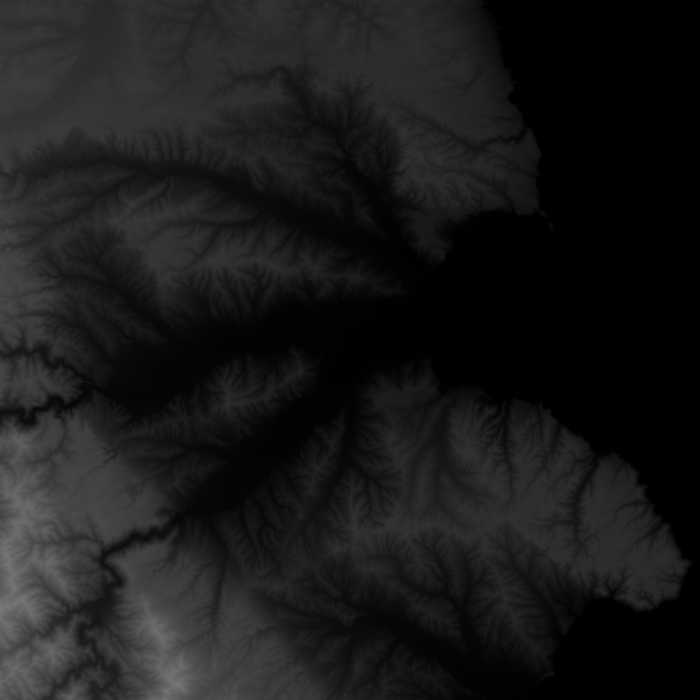
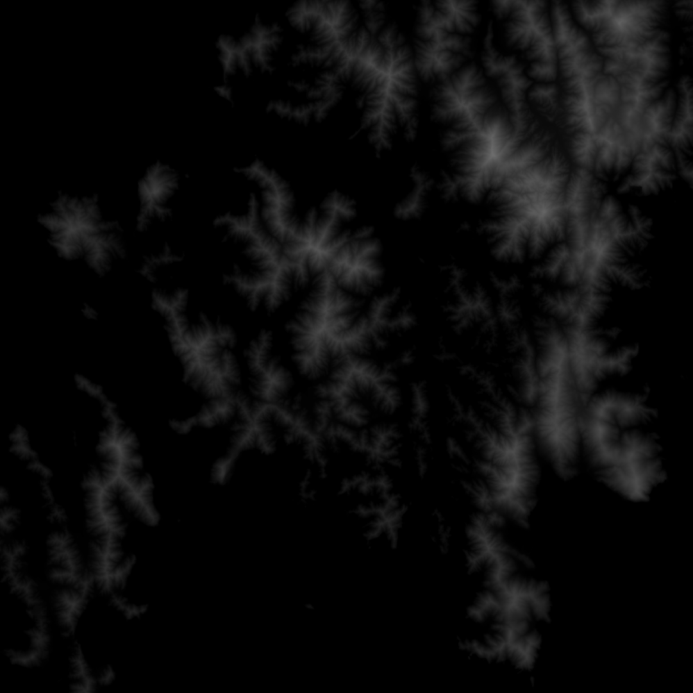
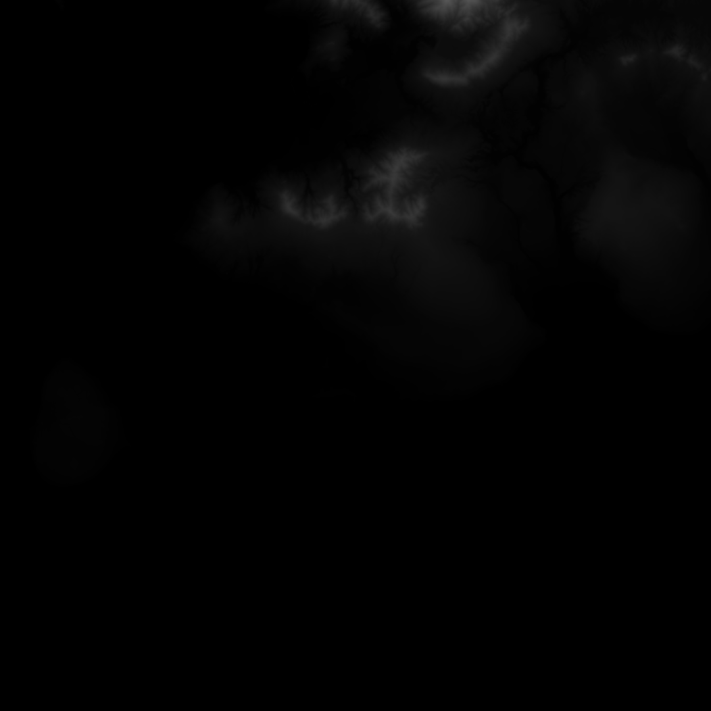

# Cities Heightfield from GSI

en / [ja](README.ja.md)

## What's this

- This is a heightfield generator for [CITIES : skylines](http://store.steampowered.com/app/255710)
- Features
    - Generate a heightfield data from GSI DEM tiles ( GSI: Geospatial Information Authority of Japan; [ja](http://www.gsi.go.jp/) [en](http://www.gsi.go.jp/ENGLISH/) )

## Usage

`cui` executable:

```
Usage (1) Interactive mode      : cui
Usage (2) Direct Invocation mode: cui [options]

Options:
        --longitude 141.315714
                        set longitude of a target
        --latitude 43.04724
                        set latitude of a target
    -o, --out out.png   set output file path
    -h, --help          show this help
    -v, --version       show the app version
```

e.g.; (1) type usage

```
cities_heightfield_from_gsi
```

And, you input parameters in interactive.

e.g.; (2) type usage

```
cities_heightfield_from_gsi --longitude 141.315714 --latitude 43.04724 --out Maruyama_Sapporo_Hokkaido_Japan.png
```

`gui` executable:

( Sorry it's under the development yet. In now, please use `cui`. )

## Output Examples

### e.g. Maruyama, Sapporo, Hokkaido, Japan

```
cities_heightfield_from_gsi --longitude 141.315714 --latitude 43.04724 --out Maruyama_Sapporo_Hokkaido_Japan.png
```


### e.g. Kuji, Iwate, Japan; 

```
cities_heightfield_from_gsi --longitude 141.775583 --latitude 40.190524 --out Kuji_Iwate_Japan.png
```



#### eg.2 Rebun, Hokkaido, Japan

```
cities_heightfield_from_gsi --latitude 45.30302 --longitude 141.047689 --out Rebun_Hokkaido_Japan.png
```


#### eg.3 Mashuuko, Teshikaga, Hokkaido, Japan

```
cities_heightfield_from_gsi --latitude 43.580411 --longitude 144.533489 --out Mashuuko_Teshikaga_Hokkaido_Japan.png
```


#### eg.4 Mutsu, Aomori, Japan

```
citis_heightfield_from_gsi --latitude 41.292746 --longitude 141.183476 --out Mutsu_Aomori_Japan.png
```


#### eg.5 Wakamatsu, Goto, Nagasaki, Japan

```
citis_heightfield_from_gsi --latitude 32.89027 --longitude 129.013749 --out Wakamatsu_Goto_Nagasaki_Japan.png
```



### eg.6 Ishigaki-shi, Okinawa, Japan

```
citis_heightfield_from_gsi --latitude 24.340661 --longitude 124.15558 --out Ishigaki_Okinawa_Japan.png
```


### Download executable binary ( Windows Only )

- https://github.com/usagi/cities_heightfield_from_gsi/releases

### How to build from the souce

```
cargo build --release
```

## License

### This app

- [MIT](LICENCE.md)

### Generated data

- [GSI Licencing Agreements](http://www.gsi.go.jp/LAW/2930-index.html) (ja)
    - [Copyright Notices](http://www.gsi.go.jp/LAW/2930-meizi.html) (ja)

## Author

Usagi Ito<usagi@WonderRabbitProject.net>
Made in Sapporo, Hokkaido, Japan.

## References

- http://www.skylineswiki.com/Map_Editor
- https://steamcommunity.com/app/255710/discussions/0/611702631244016398/?l=japanese
- https://www.reddit.com/r/CitiesSkylinesModding/comments/31l4xu/importing_model_with_maya_2014/
- http://www.linz.govt.nz/data/geodetic-system/datums-projections-heights/geodetic-datums/world-geodetic-system-1984-wgs84
- http://wiki.openstreetmap.org/wiki/Zoom_levels
