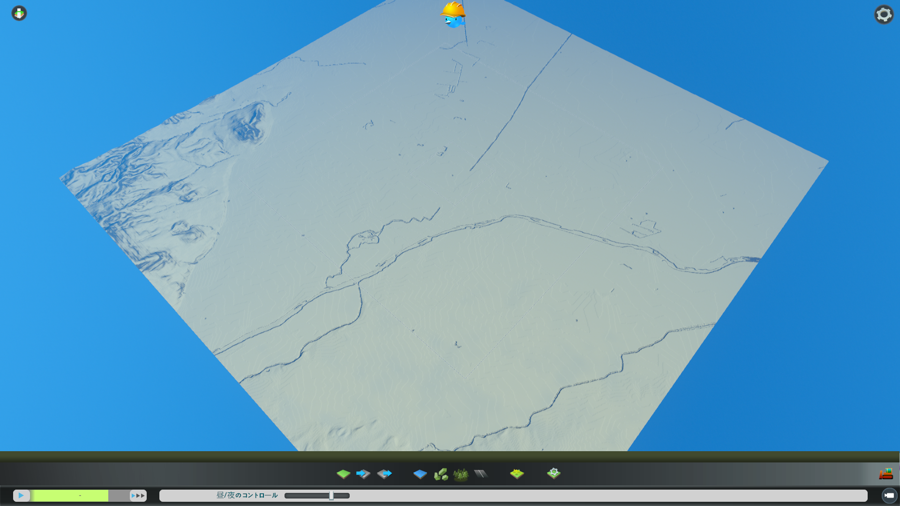
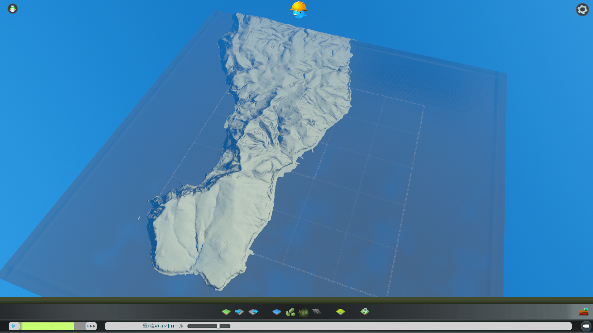
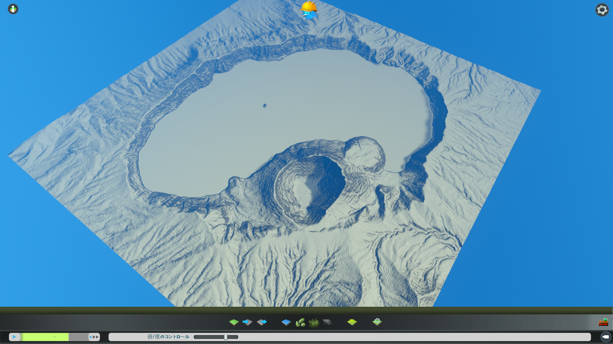
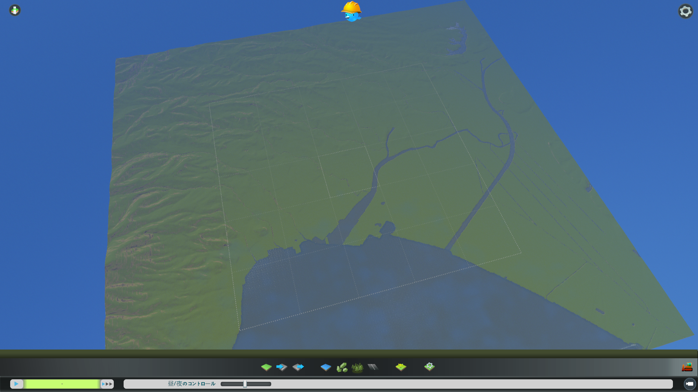
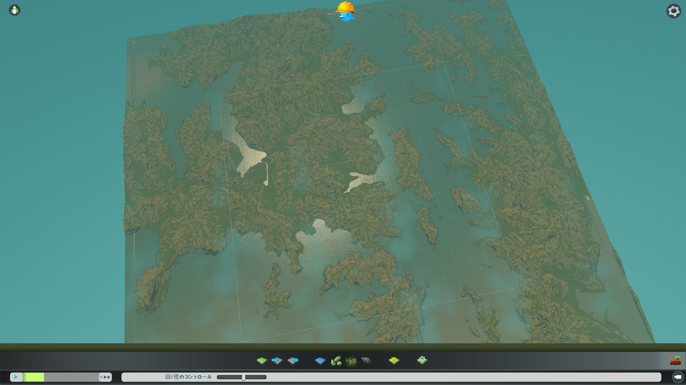
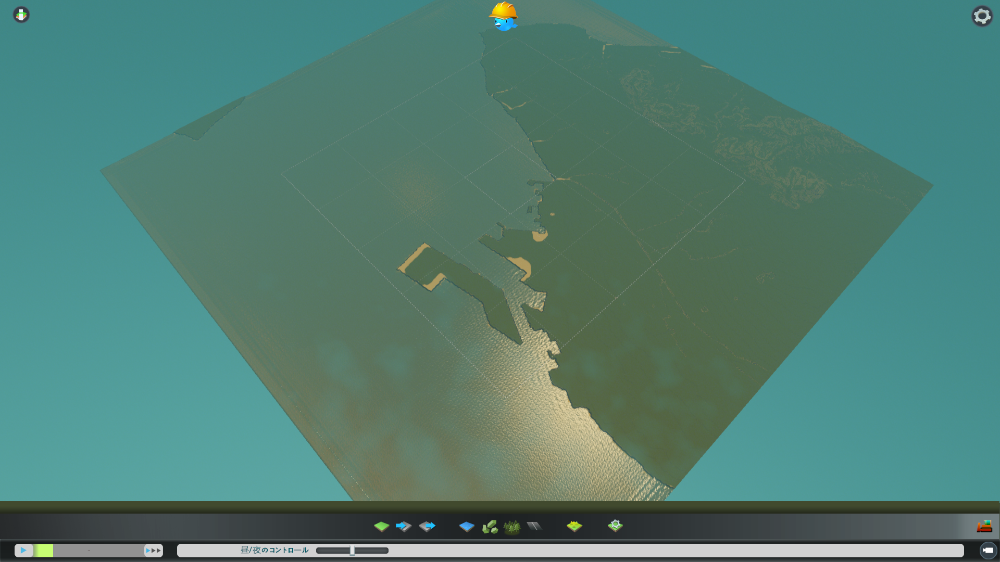

# Cities Heightfield from GSI

## What's this

- This is a heightfield generator for [CITIES : skylines](http://store.steampowered.com/app/255710)
- Features
    - Generate a heightfield data from GSI DEM tiles ( GSI: Geospatial Information Authority of Japan; [ja](http://www.gsi.go.jp/) [en](http://www.gsi.go.jp/ENGLISH/) )

## How to build ( for any platform )

- Required
    - Tool
        - [cmake](https://github.com/Kitware/CMake)
    - Library ( need prepare manually )
        - [boost](https://github.com/boostorg/boost)
    - Library ( automatic preparing with CMake/ExternalProject feature )
        - [usagi](https://github.com/usagi/usagi)
        - [stb](https://github.com/nothings/stb)
        - [cereal](https://github.com/USCiLab/cereal)
        - [cmdline](https://github.com/tanakh/cmdline)
        - [Catch](https://github.com/philsquared/Catch) ( for a testing only )
- Recommended
    - [Ninja](https://github.com/ninja-build/ninja)

```sh
git clone git@github.com:usagi/citis_heightfield_from_gsi.git
cd citis_heightfield_from_gsi
mkdir build
cd build
cmake .. -G Ninja -DBOOST_ROOT=your_boost_root_path
ninja
```

## Basic usage

### Generation

Note: Images in this examples, that's using GSI DEM tiles and GSI Relief tiles. Great thanks to GSI works.

#### eg.1 Sapporo-shi, Hokkaido, Japan // 札幌市＠北海道

```
bin/citis_heightfield_from_gsi --latitude 43.062096 --longitude 141.354376 --out Sapporo-shi_Hokkaido_Japan.png
```



#### eg.2 Rebun-chou, Hokkaido, Japan // 礼文町＠北海道

```
bin/citis_heightfield_from_gsi --latitude 45.302965 --longitude 141.047802 --out Rebun-chou_Hokkaido_Japan.png
```



#### eg.3 Mashuuko, Hokkaido, Japan // 摩周湖＠北海道

```
bin/citis_heightfield_from_gsi --latitude 43.5789292 --longitude 144.5040268 --out Mashuuko_Hokkaido_Japan.png
```



#### eg.4 Mutsu, Aomori, Japan // 陸奥＠青森

```
bin/citis_heightfield_from_gsi --latitude 41.2925597 --longitude 141.1843692 --out Mashuuko_Hokkaido_Japan.png
```



#### eg.5 Wakamatsu, Goto, Nagasaki, Japan // 五島列島若松島＠長崎

```
bin/citis_heightfield_from_gsi --latitude 32.8734429 --longitude 129.0217592 --out Wakamatsu_Goto_Nagasaki_Japan.png
```



### eg.6 Ishigaki-shi, Okinawa, Japan // 石垣市＠沖縄

```
bin/citis_heightfield_from_gsi --latitude 24.3471766 --longitude 124.1403797 --out Ishigaki-shi_Okinawa_Japan.png
```



### Version information

```
bin/citis_heightfield_from_gsi --version
```

### Help

```
bin/citis_heightfield_from_gsi --help
```

### Download a build binary ( Windows Only )

- https://github.com/usagi/cities_heightfield_from_gsi/releases

## License

### This app

- [MIT](LICENCE.md)

### Generated data

- [GSI Licencing Agreements](http://www.gsi.go.jp/LAW/2930-index.html) (ja)
    - [Copyright Notices](http://www.gsi.go.jp/LAW/2930-meizi.html) (ja)

## Author

Usagi Ito<usagi@WonderRabbitProject.net>
Made in Sapporo, Hokkaido, Japan.

## References

- http://www.skylineswiki.com/Map_Editor
- https://steamcommunity.com/app/255710/discussions/0/611702631244016398/?l=japanese
- https://www.reddit.com/r/CitiesSkylinesModding/comments/31l4xu/importing_model_with_maya_2014/
- http://www.linz.govt.nz/data/geodetic-system/datums-projections-heights/geodetic-datums/world-geodetic-system-1984-wgs84
- http://wiki.openstreetmap.org/wiki/Zoom_levels
